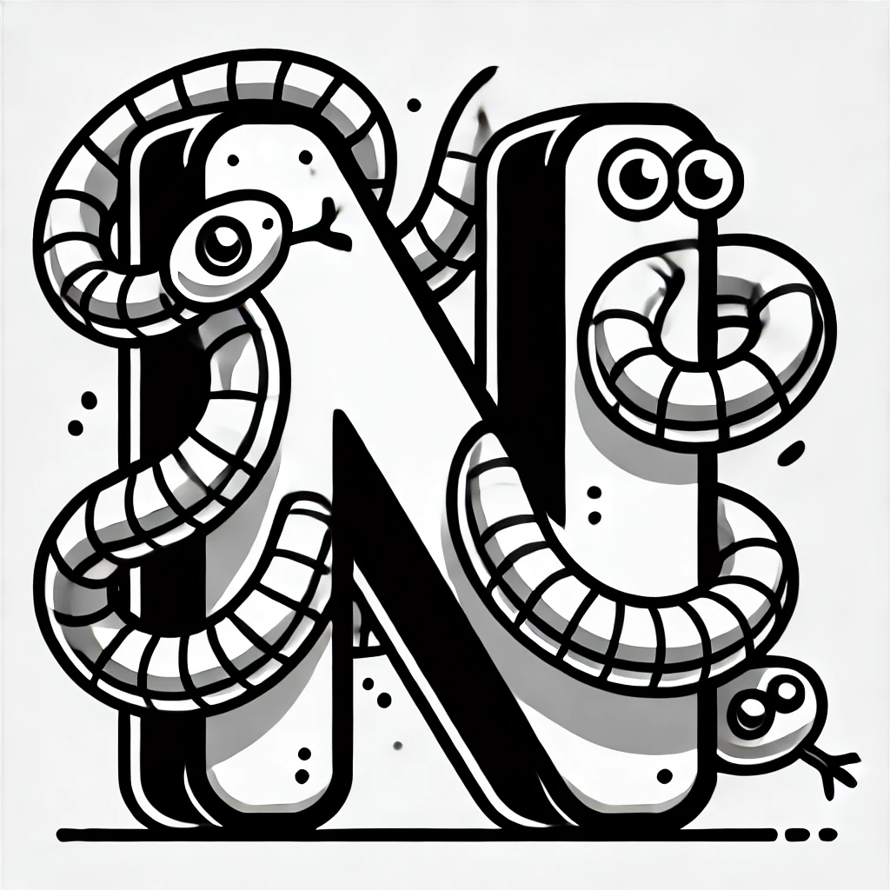

 

# Python Notion API

Python Notion API implements a client for talking with Notion API.

The key features of this implementation are:

* Async calls allowing you to send multiple requests at once
* [pydantic](https://docs.pydantic.dev/latest/) wrappers around Notion pages, properties and databases
